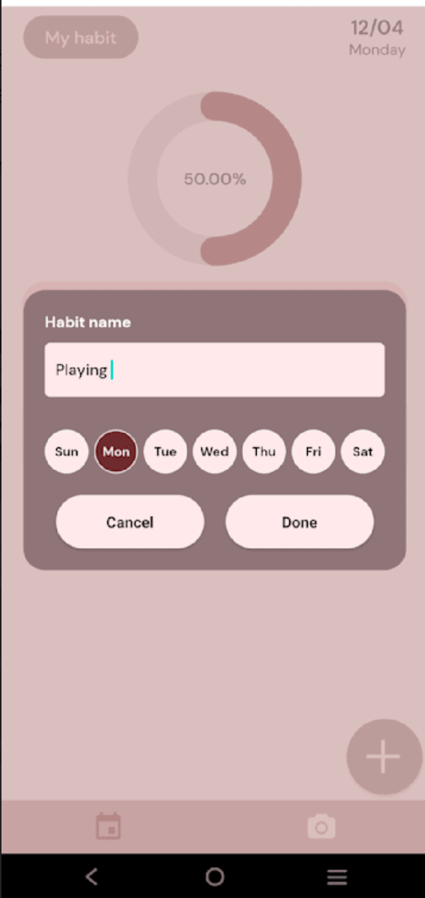
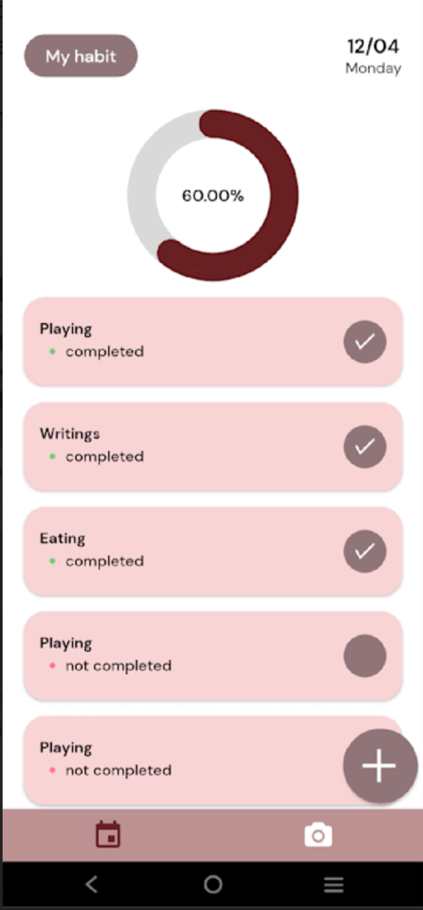

# 📸HabitPic

HabitPic is an innovative cross-platform habit tracker designed to inspire and motivate users in their self-improvement journey. By incorporating daily photo uploads, users can visually monitor their progress and recall the sense of accomplishment associated with achieving their goals. Built with React Native and JavaScript, the application is both robust and user-friendly. Leveraging the power of Expo and Firebase, HabitPic provides a seamless experience for users across different platforms. Whether you're looking to form new habits or maintain existing ones, HabitPic is your go-to tool for visually tracking your progress and finding motivation in the memories of past achievements.

## 🌟Features

- **Custom Habit Tracking**: Users can create and customize their habits with custom names, frequency, and other parameters.
- **Daily Progress Pictures**: Users can upload daily pictures to track their habit progress visually.
- **Firebase Data Management**: The app uses Firebase for secure, real-time data management and storage of user information and habits.
- **Cross-platform Compatibility**: HabitPic leverages Expo's toolset and integrated modules to ensure seamless functionality on Android, iOS, and web platforms.

  

## 🧠What I learn  
- **React Native**: A JavaScript framework for building native apps for Android and iOS.
- **JavaScript**: The primary programming language used to develop HabitPic.
- **Expo**: An open-source platform for making universal native apps for Android, iOS, and the web with JavaScript and React.
- **Firebase**: A cloud-based NoSQL database for real-time data management and storage.

